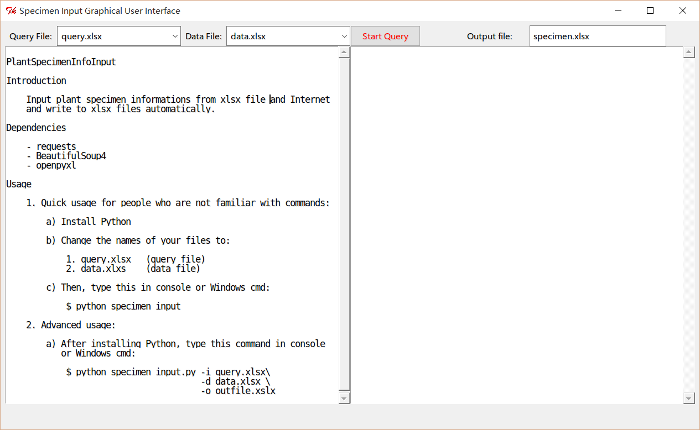

SpecimenInfo
============
Fetch and format plant specimen informations from data file and web, save
outcome to xlsx file and SQLite3 db file.

Screen Shot (GUI Version)
-------------------------

Preparation
-----------
You need to prepare two xlsx files to run this program.

- Query file (Include specimen query information)
- Data file (Include informations about specimen collection and identification)

Please download sample file for more details.

Prerequisites
-------------

- For Windows users, you need to install [Python](https://www.python.org/) before running this program.
- Install requirements:

      pip install -U requests beautifulsoup4 openpyxl

Usage
-----

1. For quick use, you can download `specimen_info_gui.py` and double click.
   You will get a graphical user interface.

   - Select valid query xlsx file (default: query.xlsx);
   - Select valid data xlsx file (default: data.xlsx);
   - Change output name if you want;
   - Click **Start Query** button to start.

   After execution, an .xlsx file and an SQLite3 db file which contains the
   detailed specimen infomations will be generated.

2. For user who are familiar with console, you can download `specimen_info.py`.
   At console or command line, type this:

        python specimen_info.py -i query.xlsx -d data.xlsx -o outfile.xlsx

   If you changed your query file and data file to default name:

   - query file: query.xlsx
   - data file: data.xlsx

   Then you can just type:

        python specimen_info.py

   After execution, an .xlsx file and an SQLite3 db file which contains the
   detailed specimen infomations will be generated.

3. For extented use: If you just want to get the output tuple and want to save
   output information to other places (for example, MySQL), do this:

        from specimen_info import (Query, write_to_xlsx_file,
                                   write_to_sqlite3)

        q = Query(query_file=query_filename, offline_data_file=data_filename)
        out_tuple_list = q.do_multi_query()

        # If you want to save output to xlsx file
        write_to_xlsx_file(out_tuple_list, xlsx_outfile_name="specimen.xlsx")

        # If you want to save output to SQLite3 db file
        write_to_sqlite3(out_tuple_list, sqlite3_file="specimen.sqlite")

        # If you want to save to other places,
        # Just write your own extension code.

Qeury File and Data File Format
-------------------------------

1. Query file

    You need these information for query xlsx file:

    1. 物种编号
    2. 流水号
    3. 条形码
    4. 物种名（二名法）
    5. 同一物种编号

2. Data file

    You need these information for data xlsx file:

    1. 物种编号
    2. 中文名
    3. 种名（拉丁）
    4. 科名
    5. 科名（拉丁）
    6. 省
    7. 市
    8. 具体小地名
    9. 纬
    10. 东经
    11. 海拔
    12. 日期
    13. 份数
    14. 草灌
    15. 采集人
    16. 鉴定人
    17. 鉴定日期
    18. 录入员
    19. 录入日期

3. Output information format (in xlsx file database)

    1. 馆代码
    2. 流水号
    3. 条形码
    4. 模式类型
    5. 库存
    6. 标本状态
    7. 采集人
    8. 采集号
    9. 采集日期
    10. 国家
    11. 省市
    12. 区县
    13. 海拔
    14. 负海拔
    15. 科
    16. 属
    17. 种
    18. 定名人
    19. 种下等级
    10. 中文名
    21. 鉴定人
    22. 鉴定日期
    23. 备注
    24. 地名
    25. 生境
    26. 经度
    27. 纬度
    28. 备注2
    29. 录入员
    30. 录入日期
    31. 习性
    32. 体高
    33. 胸径
    34. 茎
    35. 叶
    36. 花
    37. 果实
    38. 寄主

